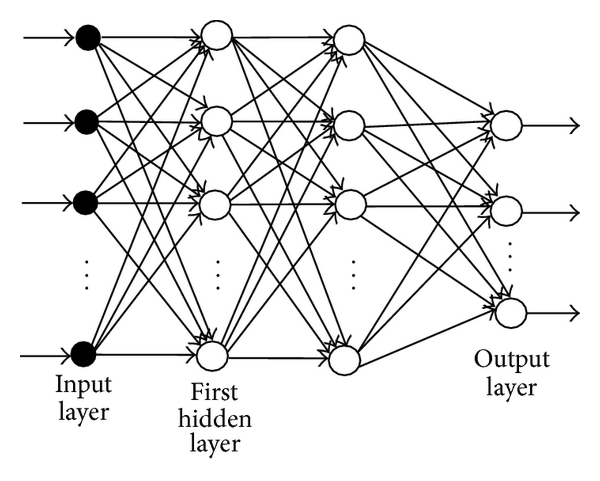

# An Introduction to Convolutional Neural Network

@article{o2015introduction,
  title={An introduction to convolutional neural networks},
  author={O'Shea, Keiron and Nash, Ryan},
  journal={arXiv preprint arXiv:1511.08458},
  year={2015}
}

## Resumen 
Los modelos biologicamente inspirados son llamados Redes Neuronales Artificiales, ANN por sus siglas en ingles, han tenido un aumento en su usuo por los resultados mostrados al aprender diferentes tareas de aprendizaje. Las Redes Neuronales Convolucionales, son un tipo de red que usa las convoluciones como operación principal y son usadas para tareas de detección.

## Prerequisitos
- Tener conocimientos en aprendizaje de máquinas.
- Tener conocimientos de la arquitectura ANN.

## Introducción
Las redes neuronales artificiaes son procesos computacionales fuertemente inspirados por el sistema nervioso. ANN son principalente un gran número de nodos computacionales interconectados, la estrucutra básica de una red neuronal se aprecia en la siguiente imágen.

Al tener la capacidad de poseer multiples capas ocultas es normal llamarles apredizaje profundo. LAs redes convolucionales son un análogo a las redes ANN tradicionales en el sentido de que ambas arquitecturas contiene neuronas que serán auto-optimizadas a través del entrenamiento. La única diferencia a resaltar es que las CNN son usadas principalmente en el campo de la detección de patrones en las imágenes. 